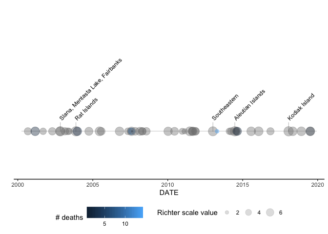

<!-- README.md is generated from README.Rmd. Please edit that file -->

# noaaeq

<!-- badges: start -->

[](https://travis-ci.org/kamenbliznashki/noaaeq)
<!-- badges: end -->

Visualization geoms on NOAA Significant Earthquake Database

This package loads, cleans, and plots the significant earthquakes
dataset from the U.S. National Oceanographic and Atmospheric
Administration (NOAA) (link - [NOAA Significant Earthquake
Database](https://www.ngdc.noaa.gov/nndc/struts/form?t=101650&s=1&d=1)).

## Installation

Development version:

``` r
library(devtools)
install_github("kamenbliznashki/noaaeq")
```

## Example

``` r
library(tidyverse)
library(noaaeq)

# the package includes NOAA raw data (accessed on 1/7/2020) to demo
filepath = system.file("extdata", "earthquakes.txt", package = "noaaeq")

read_delim(filepath, delim = "\t") %>% 
  eq_clean_data() %>% 
  filter(COUNTRY == "USA" & DATE >= '2000-01-01') %>% 
  ggplot() +
  geom_timeline_label(aes(x=DATE, group=COUNTRY, size=EQ_PRIMARY,
                          color=DEATHS, label=LOCATION_NAME)) +
  scale_y_continuous(limits = c(0, 4)) +
  labs(y='', size='Richter scale value', color = '# deaths') +
  theme_timeline()
```



## Documentation

See the package vignette for:

  - data loading and cleaning
  - timeline visualization for one or more countries
  - map visualization
